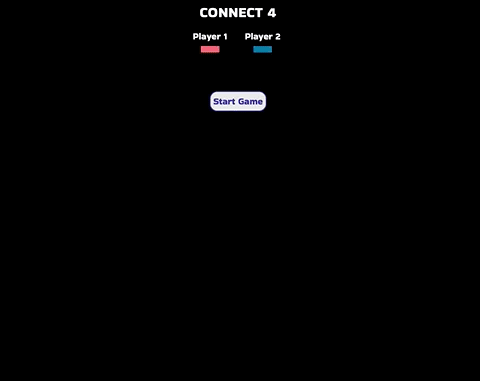

# Connect 4

## **Live Website**

### 👉[Click here to open website](https://cng008.github.io/11_connect-four/)

---

### **Purpose**

- Build a connect four game using DOM Manipulation, advanced array methods, and ES2015 for study purposes.

### **Overview**

Connect Four is played on a grid, 7 wide by 6 deep, with two players, 1 (red) and 2 (blue). The players alternate turns, dropping a piece of their color in the top of a column. The piece will fall down to the further-down unoccupied slot.

The game is won when a player makes four in a row (horizontally, vertically, or diagonally). The game is a tie if the entire board fills up without a winner.

---

---

## **Technologies**

This project was made using the following technologies:

- [Javascript](https://www.javascript.com)
- [HTML](https://developer.mozilla.org/en-US/docs/Web/HTML)
- [CSS](https://developer.mozilla.org/en-US/docs/Web/CSS)
- [VSCode](https://code.visualstudio.com/docs)
